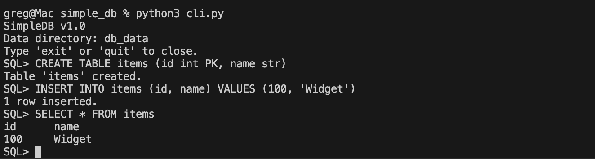

# Simple RDBMS

A Relational Database Management System built in Python.
Created for the Pesapal JDEV26 Developer Challenge to demonstrate systems programming fundamentals, data modeling, and query processing logic without relying on external database libraries.

## Motivation & Scope
This project was built to explore the internal mechanics of a database engine. The goal was **not** to build a production-grade substitute for PostgreSQL or SQLite, but rather to implement the core primitives of an RDBMS to show clear thinking and technical determination.

**Intentionally Implemented:**
- Core storage engine.
- Custom SQL parsing (Regex-based).
- Simple, correctness-first strategies for query execution.

**Explicitly Omitted:**
- Binary storage format (JSON used for inspectability).
- ACID Transactions (out of scope for time).
- Complex Query Optimization (Cost-based optimizer).

## High-Level Architecture
The system follows a standard modular database architecture:

```
[ User / Web App ]
       ↓
[ REPL / API Interface ]
       ↓
[ SQL Parser (Regex) ]      -> Converts string to Query Object
       ↓
[ Query Executor ]          -> Orchestrates data retrieval
       ↓
[ Core Engine (Table/DB) ]  -> Manages rows, columns, and constraints
       ↓
[ Indexer (Hash Map) ]      -> Enforces Unique/PK checks & Equality Lookups
       ↓
[ Storage (File System) ]   -> JSON persistence
```

## Why Python?
1.  **Clarity**: The logical flow of a database engine is complex; Python's syntax allows these concepts to be expressed clearly and concisely for review.
2.  **No Dependencies**: The standard library (`re`, `json`, `http.server`) allowed the entire system to be built without external packages.

## Supported Features
- **Data Definition**: `CREATE TABLE` with typed columns (`int`, `str`, `float`, `bool`).
- **Constraints**: Primary Key (`PK`) and Unique constraints.
- **Data Manipulation**: Full CRUD (`INSERT`, `SELECT`, `UPDATE`, `DELETE`).
- **Querying**: `WHERE` clause filtering (equality checks).
- **Joins**: `INNER JOIN` support.
- **Indexing**: In-memory Hash Index.
- **Interface**: Interactive Command-Line REPL.

## SQL Syntax
The engine supports a strict subset of SQL:

**Create Table**
```sql
CREATE TABLE users (id int PK, name str, email str UNIQUE)
```

**Insert Data**
```sql
INSERT INTO users (id, name, email) VALUES (1, 'Alice', 'alice@example.com')
```

**Select Data**
```sql
SELECT id, name FROM users WHERE id=1
```

**Join Tables**
```sql
SELECT users.name, posts.title 
FROM users 
JOIN posts ON users.id = posts.user_id
```

## Storage Model
- **Format**: Each table is stored as a separate `.json` file in the `db_data/` directory.
- **Representation**: Rows are stored as a list of dictionaries (`List[Dict[str, Any]]`).
- **Design Choice**: JSON was chosen over a binary format to facilitate debugging and manual inspection.
- **Trade-off**: While this simplifies development, it sacrifices the storage efficiency and partial-read capabilities of a binary page format.

## Indexing Strategy
- **Type**: Hash Index (Python Dictionary).
- **Implementation**: The system maintains an in-memory map of `{ value: row_index }` for every column marked as `PK` or `UNIQUE`.
- **Benefit**: Provides **O(1)** time complexity for uniqueness checks and equality lookups (e.g., `WHERE id=1`).
- **Limitation**: Hash indexes do not support range queries (`>`, `<`).

## Join Strategy
- **Type**: Nested Loop Join.
- **Algorithm**: For every row in the outer table, scan the inner table for a match.
- **Complexity**: **O(N * M)**, where N and M are the row counts of the two tables.
- **Note**: This implementation does not currently utilize indexes for joins, scanning the full table instead for simplicity and correctness.

## REPL (Interactive Mode)
The project includes a Read-Eval-Print Loop for direct interaction.

**Example Session:**
```text
$ python3 cli.py
SimpleDB v1.0
SQL> CREATE TABLE items (id int PK, name str)
Table 'items' created.
SQL> INSERT INTO items (id, name) VALUES (100, 'Widget')
1 row inserted.
SQL> SELECT * FROM items
id    name
100   Widget
```



## Web Application Demo
A dependency-free Web App (`webapp_server.py`) demonstrates the database in practice.
- **Purpose**: Proves the DB can persist data for a real application.
- **Functionality**: A "To-Do List" allowing users to Add (INSERT) and Delete (DELETE) tasks.


## Limitations
1.  **Concurrency**: The system is single-threaded and does not support concurrent transactions (no locking mechanisms).
2.  **Parser Rigidity**: The regex parser breaks on complex nested strings or unescaped characters.
3.  **Memory Bound**: All tables are loaded into memory on startup; dataset size is limited by RAM.
4.  **No Query Optimizer**: Queries are executed exactly as written, without reordering for efficiency.

## Future Improvements
1.  **B-Tree Indexing**: To support efficient range queries (`WHERE age > 18`).
2.  **Page-Based Storage**: Implementing a paging system to read data from disk in chunks rather than all-at-once.
3.  **Basic Write-Ahead Logging**: To provide crash recovery and atomicity.

## How to Run

**Prerequisites:** Python 3.8+

**1. Setup**
Clone the repository and navigate to the project folder:
```bash
git clone <repo_url>
cd simple_db
```

**2. Run Tests**
Validate the system logic:
```bash
python3 test_core.py
python3 test_sql.py
```

**3. Run REPL**
Start the database shell:
```bash
python3 cli.py
```

**4. Run Web Demo**
Start the server and open `http://localhost:8000`:
```bash
python3 webapp_server.py
```

## Credits & Acknowledgements
- **Design & Code**: Greg
- **Assistance**: Generative AI tools were used for initial code scaffolding and generating test cases. All architectural decisions and final logic implementation were verified and refined manually.
- **Inspiration**: SQLite architecture documentation.

---
*This project is a submission for the Pesapal JDEV26 Challenge.*